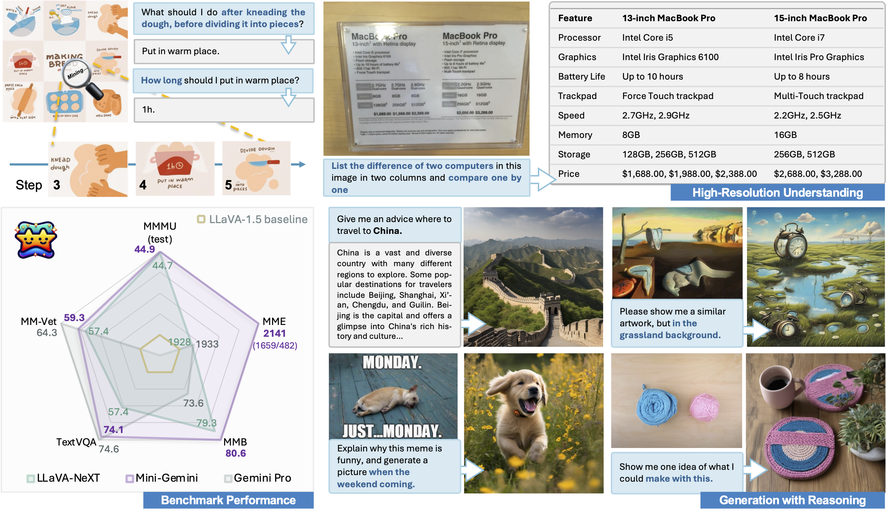
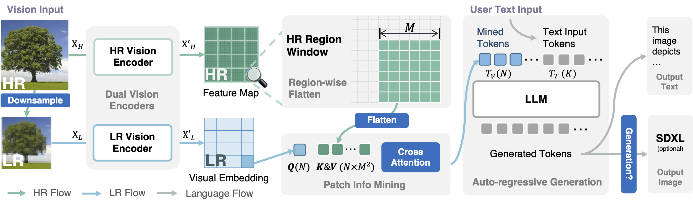
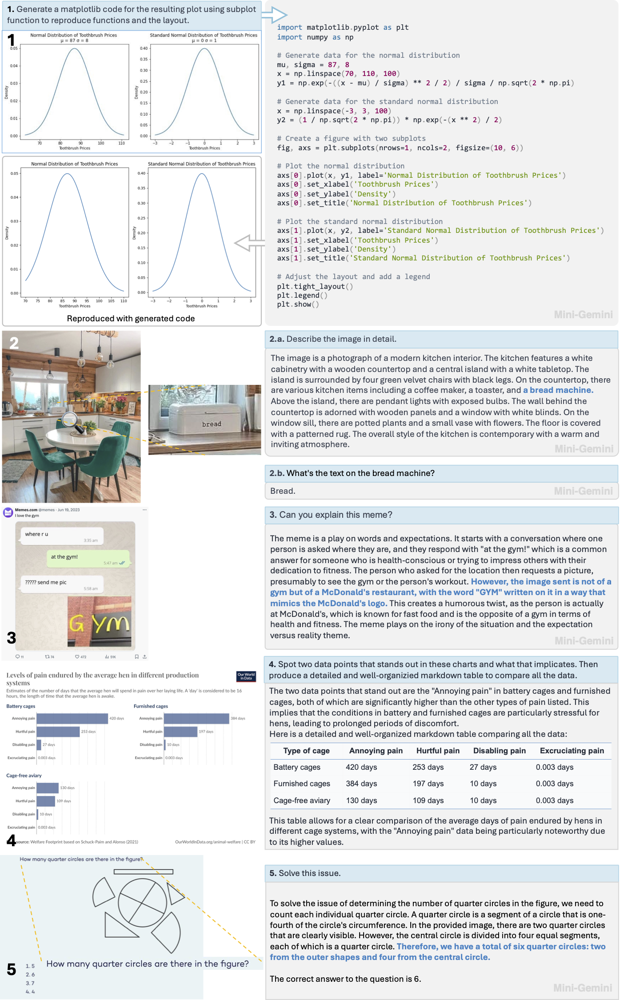

# Official repo for "Mini-Gemini: Mining the Potential of Multi-modality Vision Language Models"

<a href='https://mini-gemini.github.io/'></a>
<a href='http://103.170.5.190:7860/'></a>
<a href='https://huggingface.co/spaces/wcy1122/MGM'></a>
<a href='https://arxiv.org/pdf/2403.18814.pdf'></a>
<a href='https://huggingface.co/collections/YanweiLi/mgm-6603c50b9b43d044171d0854'></a>
<a href='https://huggingface.co/collections/YanweiLi/mgm-data-660463ea895a01d8f367624e'></a>


The framework supports a series of dense and MoE Large Language Models (LLMs) from 2B to 34B with image understanding, reasoning, and generation simultaneously. We build this repo based on LLaVA.

## Release
- [05/03] 🔥 We support LLaMA3-based models! Welcome to try them [here](https://huggingface.co/collections/YanweiLi/mgm-6603c50b9b43d044171d0854).
- [04/15] 🔥 The [Hugging Face demo](https://huggingface.co/spaces/wcy1122/MGM) is available. It's a 13B-HD version, welcome to watch and try.
- [03/28] 🔥 Mini-Gemini is coming! We release the [paper](https://arxiv.org/pdf/2403.18814.pdf), [demo](http://103.170.5.190:7860/), [code](https://github.com/dvlab-research/MGM), [models](https://huggingface.co/collections/YanweiLi/mgm-6603c50b9b43d044171d0854'), and [data](https://huggingface.co/collections/YanweiLi/mgm-data-660463ea895a01d8f367624e)!

## Contents
- [Demo](#demo)
- [Install](#install)
- [Model](#model)
- [Preparation](#preparation)
- [Train](#train)
- [Evaluation](#evaluation)
- [Examples](#examples)
- [Citation](#citation)
- [Acknowledgement](#acknowledgement)
- [License](#license)

## Demo
We provide some selected examples in this section. More examples can be found in our [project page](https://mini-gemini.github.io/). Feel free to try our online [demo](http://103.170.5.190:7860/)!

<div align=center>

</div>

## Install
Please follow the instructions below to install the required packages.

NOTE: If you want to use the 2B version, please ensure to install the latest version Transformers (>=4.38.0).

1. Clone this repository
```bash
git clone https://github.com/dvlab-research/MGM.git
```

2. Install Package
```bash
conda create -n mgm python=3.10 -y
conda activate mgm
cd MGM
pip install --upgrade pip  # enable PEP 660 support
pip install -e .
```

3. Install additional packages for training cases
```bash
pip install ninja
pip install flash-attn --no-build-isolation
```

## Model
The framework is conceptually simple: dual vision encoders are utilized to provide low-resolution visual embedding and high-resolution candidates;
patch info mining is proposed to conduct patch-level mining between high-resolution regions and low-resolution visual queries;
LLM is utilized to marry text with images for both comprehension and generation at the same time.

<div align=center>

</div>

We provide all our fully finetuned models on Stage 1 and 2 data:

| Model | LR | HR | Base LLM | Vision Encoder | Finetuning Data | Finetuning schedule | Download |
|----------|----------|----------|----------|----------------|---------------|--------------------|------------------|
| MGM-2B | 336 | 768 | Gemma-2B | CLIP-L | MGM-Instruct | full_ft-1e | [ckpt](https://huggingface.co/YanweiLi/MGM-2B) |
| MGM-7B | 336 | 768 | Vicuna-7B-v1.5 | CLIP-L | MGM-Instruct | full_ft-1e | [ckpt](https://huggingface.co/YanweiLi/MGM-7B) |
| MGM-13B | 336 | 768 | Vicuna-13B-v1.5 | CLIP-L | MGM-Instruct | full_ft-1e | [ckpt](https://huggingface.co/YanweiLi/MGM-13B) |
| MGM-8B | 336 | 768 | LLaMA-3-8B-Instruct | CLIP-L | MGM-Instruct | full_ft-1e | [ckpt](https://huggingface.co/YanweiLi/MGM-8B) |
| MGM-8x7B | 336 | 768 | Mixtral-8x7B-Instruct-v0.1 | CLIP-L | MGM-Instruct | full_ft-1e | [ckpt](https://huggingface.co/YanweiLi/MGM-8x7B) |
| MGM-34B | 336 | 768 | Nous-Hermes-2-Yi-34B | CLIP-L | MGM-Instruct | full_ft-1e | [ckpt](https://huggingface.co/YanweiLi/MGM-34B) |
| MGM-7B-HD | 672 | 1536 | Vicuna-7B-v1.5 | CLIP-L | MGM-Instruct | full_ft-1e | [ckpt](https://huggingface.co/YanweiLi/MGM-7B-HD) |
| MGM-13B-HD | 672 | 1536 | Vicuna-13B-v1.5 | CLIP-L | MGM-Instruct | full_ft-1e | [ckpt](https://huggingface.co/YanweiLi/MGM-13B-HD) |
| MGM-8B-HD | 672 | 1536 | LLaMA-3-8B-Instruct | CLIP-L | MGM-Instruct | full_ft-1e | [ckpt](https://huggingface.co/YanweiLi/MGM-8B-HD) |
| MGM-8x7B-HD | 672 | 1536 | Mixtral-8x7B-Instruct-v0.1 | CLIP-L | MGM-Instruct | full_ft-1e | [ckpt](https://huggingface.co/YanweiLi/MGM-8x7B-HD) |
| MGM-34B-HD | 672 | 1536 | Nous-Hermes-2-Yi-34B | CLIP-L | MGM-Instruct | full_ft-1e | [ckpt](https://huggingface.co/YanweiLi/MGM-34B-HD) |

Here are the pretrained weights on Stage 1 data only:
| Model | LR | HR | Base LLM | Vision Encoder | Pretrain Data | Finetuning schedule | Download |
|----------|----------|----------|----------|----------------|---------------|--------------------|------------------|
| MGM-2B | 336 | 768 | Gemma-2B | CLIP-L | MGM-Pretrain | 1e | [ckpt](https://huggingface.co/YanweiLi/MGM-Pretrain/tree/main/MGM-2B) |
| MGM-7B | 336 | 768 | Vicuna-7B-v1.5 | CLIP-L | MGM-Pretrain | 1e | [ckpt](https://huggingface.co/YanweiLi/MGM-Pretrain/tree/main/MGM-7B) |
| MGM-13B | 336 | 768 | Vicuna-13B-v1.5 | CLIP-L | MGM-Pretrain | 1e | [ckpt](https://huggingface.co/YanweiLi/MGM-Pretrain/tree/main/MGM-13B) |
| MGM-8x7B | 336 | 768 | Mixtral-8x7B-Instruct-v0.1 | CLIP-L | MGM-Pretrain | 1e | [ckpt](https://huggingface.co/YanweiLi/MGM-Pretrain/tree/main/MGM-8x7B) |
| MGM-34B | 336 | 768 | Nous-Hermes-2-Yi-34B | CLIP-L | MGM-Pretrain | 1e | [ckpt](https://huggingface.co/YanweiLi/MGM-Pretrain/tree/main/MGM-34B) |

## Preparation
### Dataset
We provide the processed data for the model training. 
For model pretraining, please download the following the training image-based data and organize them as:

`->` means put the data in the local folder.
- [LLaVA Images](https://huggingface.co/datasets/liuhaotian/LLaVA-Pretrain) -> `data/MGM-Pretrain/images`, `data/MGM-Finetune/llava/LLaVA-Pretrain/images`
- [ALLaVA Caption](https://github.com/FreedomIntelligence/ALLaVA) -> `data/MGM-Pretrain/ALLaVA-4V`

For model finetuning, please download the following the instruction data and organize them as:

`->` means put the data in the local folder.
- [COCO train2017](http://images.cocodataset.org/zips/train2017.zip) -> `data/MGM-Finetune/coco`
- [GQA](https://downloads.cs.stanford.edu/nlp/data/gqa/images.zip) -> `data/MGM-Finetune/gqa`
- [OCR-VQA](https://drive.google.com/drive/folders/1_GYPY5UkUy7HIcR0zq3ZCFgeZN7BAfm_?usp=sharing) (**we save all files as `.jpg`**) -> `data/MGM-Finetune/ocr_vqa`
- [TextVQA](https://dl.fbaipublicfiles.com/textvqa/images/train_val_images.zip) (not included for training) -> `data/MGM-Finetune/textvqa`
- [VisualGenome part1](https://cs.stanford.edu/people/rak248/VG_100K_2/images.zip), [VisualGenome part2](https://cs.stanford.edu/people/rak248/VG_100K_2/images2.zip) -> `data/MGM-Finetune/vg`
- [ShareGPT4V-100K](https://github.com/InternLM/InternLM-XComposer/blob/main/projects/ShareGPT4V/docs/Data.md) -> `data/MGM-Finetune/sam`, `share_textvqa`, `wikiart`, `web-celebrity`, `web-landmark`
- [LAION GPT4V](https://huggingface.co/datasets/laion/gpt4v-dataset) -> `data/MGM-Finetune/gpt4v-dataset`
- [ALLaVA Instruction](https://github.com/FreedomIntelligence/ALLaVA) -> `data/MGM-Pretrain/ALLaVA-4V`
- [DocVQA](https://www.docvqa.org/datasets/docvqa) -> `data/MGM-Finetune/docvqa`
- [ChartQA](https://github.com/vis-nlp/ChartQA) -> `data/MGM-Finetune/chartqa`
- [DVQA](https://github.com/kushalkafle/DVQA_dataset) -> `data/MGM-Finetune/dvqa`
- [AI2D](https://allenai.org/data/diagrams) -> `data/MGM-Finetune/ai2d`

For model evaluation, please follow this [link](https://github.com/haotian-liu/LLaVA/blob/main/docs/Evaluation.md) for preparation. We use some extra benchmarks for evaluation. please download the following the training image-based data and organize them as:

`->` means put the data in the local folder.
- [MMMU](https://mmmu-benchmark.github.io/) -> `data/MGM-Eval/MMMU`
- [MMB](https://github.com/open-compass/mmbench/) -> `data/MGM-Eval/MMB`
- [MathVista](https://mathvista.github.io/) -> `data/MGM-Eval/MathVista`


Please put the pretrained data, finetuned data, and eval data in  `MGM-Pretrain`, `MGM-Finetune`, and `MGM-Eval` subset following [Structure](#structure).


For meta info, please download the following files and organize them as in [Structure](#structure).

| Data file name | Size |
| --- | ---: |
| [mgm_pretrain.json](https://huggingface.co/datasets/YanweiLi/MGM-Pretrain) | 1.68 G |
| [mgm_instruction.json](https://huggingface.co/datasets/YanweiLi/MGM-Instruction) | 1.79 G |
| [mgm_generation_pure_text.json](https://huggingface.co/datasets/YanweiLi/MGM-Instruction) | 0.04 G |

IMPORTANT: `mgm_generation_pure_text.json` is a generation-related subset. **DO NOT** merge it with `mgm_instruction.json` as it is already included in it. You may merge this file with your customized LLM/VLM SFT dataset to enable the reasoning generation ability.


### Pretrained Weights
We recommend users to download the pretrained weights from the following link [CLIP-Vit-L-336](https://huggingface.co/openai/clip-vit-large-patch14-336), [OpenCLIP-ConvNeXt-L](https://huggingface.co/laion/CLIP-convnext_large_d_320.laion2B-s29B-b131K-ft-soup), [Gemma-2b-it](https://huggingface.co/google/gemma-2b-it), [Vicuna-7b-v1.5](https://huggingface.co/lmsys/vicuna-7b-v1.5), [Vicuna-13b-v1.5](https://huggingface.co/lmsys/vicuna-13b-v1.5), [Mixtral-8x7B-Instruct-v0.1](https://huggingface.co/mistralai/Mixtral-8x7B-Instruct-v0.1), and [Nous-Hermes-2-Yi-34B](https://huggingface.co/NousResearch/Nous-Hermes-2-Yi-34B) , and put them in `model_zoo` following [Structure](#structure).


### Structure

The folder structure should be organized as follows before training.

```
MGM
├── mgm
├── scripts
├── work_dirs
│   ├── MGM
│   │   ├── MGM-2B
│   │   ├── ...
├── model_zoo
│   ├── LLM
│   │   ├── gemma
│   │   │   ├── gemma-2b-it
│   │   ├── vicuna
│   │   │   ├── 7B-V1.5
│   │   │   ├── 13B-V1.5
│   │   ├── llama-3
│   │   │   ├── Meta-Llama-3-8B-Instruct
│   │   │   ├── Meta-Llama-3-70B-Instruct
│   │   ├── mixtral
│   │   │   ├── Mixtral-8x7B-Instruct-v0.1
│   │   ├── Nous-Hermes-2-Yi-34B
│   ├── OpenAI
│   │   ├── clip-vit-large-patch14-336
│   │   ├── openclip-convnext-large-d-320-laion2B-s29B-b131K-ft-soup
├── data
│   ├── MGM-Pretrain
│   │   ├── mgm_pretrain.json
│   │   ├── images
│   │   ├── ALLaVA-4V
│   ├── MGM-Finetune
│   │   ├── mgm_instruction.json
│   │   ├── llava
│   │   ├── coco
│   │   ├── gqa
│   │   ├── ocr_vqa
│   │   ├── textvqa
│   │   ├── vg
│   │   ├── gpt4v-dataset
│   │   ├── sam
│   │   ├── share_textvqa
│   │   ├── wikiart
│   │   ├── web-celebrity
│   │   ├── web-landmark
│   │   ├── ALLaVA-4V
│   │   ├── docvqa
│   │   ├── chartqa
│   │   ├── dvqa
│   │   ├── ai2d
│   ├── MGM-Eval
│   │   ├── MMMU
│   │   ├── MMB
│   │   ├── MathVista
│   │   ├── ...
```

## Train

The training process consists of two stages: (1) feature alignment stage: bridge the vision and language tokens; (2) instruction tuning stage: teach the model to follow multimodal instructions.

Our models are trained on 8 A100 GPUs with 80GB memory. To train on fewer GPUs, you can reduce the `per_device_train_batch_size` and increase the `gradient_accumulation_steps` accordingly. Always keep the global batch size the same: `per_device_train_batch_size` x `gradient_accumulation_steps` x `num_gpus`.

Please make sure you download and organize the data following [Preparation](#preparation) before training.

NOTE: Please set `hostfile` for 2 machine training and `hostfile_4` for 4 machine training.

If you want to train and finetune the framework, please run the following command for MGM-7B with image size 336:

```bash
bash scripts/llama/train/stage_1_2_full_v7b_336_hr_768.sh
```
or for MGM-13B with image size 336:
```bash
bash scripts/llama/train/stage_1_2_full_v13b_336_hr_768.sh
```
Because we reuse the pre-trained projecter weights from the MGM-7B, you can directly use the MGM-7B-HD with image size 672 for stage-2 instruction tuning:
```bash
bash scripts/llama/train/stage_2_full_v7b_672_hr_1536.sh
```
Please find more training scripts of `gemma`, `llama`, `mixtral`, and `yi` in `scripts/`.


## Evaluation
We perform evaluation on several image-based benchmarks. Please download the evaluation data following [Preparation](#preparation) and organize them as in [Structure](#structure).

| Model | LLM | Res. | Link | TextVQA | MMB | MME | MM-Vet | MMMU_val | MMMU_test | MathVista |
|----------|----------|----------|-----------|---|---|---|---|---|---|---|
MGM-2B | Gemma-2B | 336 | [ckpt](https://huggingface.co/YanweiLi/MGM-2B) | 56.2 | 59.8 | 1341/312 | 31.1 | 31.7 | 29.1 | 29.4
MGM-7B | Vicuna-7B-v1.5 | 336 | [ckpt](https://huggingface.co/YanweiLi/MGM-7B) | 65.2 | 69.3 | 1523/316 | 40.8 | 36.1 | 32.8 | 31.4 
MGM-13B | Vicuna-13B-v1.5 | 336 | [ckpt](https://huggingface.co/YanweiLi/MGM-13B) | 65.9 | 68.5 | 1565/322 | 46.0 | 38.1 | 33.5 | 37.0
MGM-8B | LLaMA-3-8B-Instruct | 336 | [ckpt](https://huggingface.co/YanweiLi/MGM-8B) | 67.6 | 72.7 | 1606/341 | 47.3 | 38.2 | 36.3 | --
MGM-8x7B | Mixtral-8x7B-Instruct-v0.1 | 336 | [ckpt](https://huggingface.co/YanweiLi/MGM-8x7B) | 69.2 | 75.6 | 1639/379 | 45.8 | 41.8 | 37.1 | 41.8
MGM-34B | Nous-Hermes-2-Yi-34B | 336 | [ckpt](https://huggingface.co/YanweiLi/MGM-34B) | 70.1 | 79.6 | 1666/439 | 53.0 | 48.7 | 43.6 | 38.9
MGM-7B-HD | Vicuna-7B-v1.5 | 672 | [ckpt](https://huggingface.co/YanweiLi/MGM-7B-HD) | 68.4 | 65.8 | 1546/319 | 41.3 | 36.8 | 32.9 | 32.2
MGM-13B-HD | Vicuna-13B-v1.5 | 672 | [ckpt](https://huggingface.co/YanweiLi/MGM-13B-HD) | 70.2 | 68.6 | 1597/320 | 50.5 | 37.3 | 35.1 | 37.0
MGM-8B-HD | LLaMA-3-8B-Instruct | 672 | [ckpt](https://huggingface.co/YanweiLi/MGM-8B-HD) | 71.6 | -- | 1532/357 | -- | 37.0 | -- | --
MGM-8x7B-HD | Mixtral-8x7B-Instruct-v0.1 | 672 | [ckpt](https://huggingface.co/YanweiLi/MGM-8x7B-HD) | 71.9 | 74.7 | 1633/356 | 53.5 | 40.0 | 37.0 | 43.1
MGM-34B-HD | Nous-Hermes-2-Yi-34B | 672 | [ckpt](https://huggingface.co/YanweiLi/MGM-34B-HD) | 74.1 | 80.6 | 1659/482 | 59.3 | 48.0 | 44.9 | 43.3


If you want to evaluate the model on image-based benchmarks, please use the scripts in `scripts/MODEL_PATH/eval`. 
For example, run the following command for TextVQA evaluation with MGM-7B-HD:
```bash
bash scripts/llama/eval/textvqa.sh
```
Please find more evaluation scripts in `scripts/MODEL_PATH`.


### CLI Inference
Chat with images without the need of Gradio interface. It also supports multiple GPUs, 4-bit and 8-bit quantized inference. With 4-bit quantization.
Please make sure you have installed [diffusers](https://github.com/huggingface/diffusers) and [PaddleOCR](https://github.com/PaddlePaddle/PaddleOCR/blob/release/2.7/README_en.md) (only for better experience with OCR), and try this for image and generation inference:

```bash
python -m mgm.serve.cli \
    --model-path work_dirs/MGM/MGM-13B-HD \
    --image-file <path to your image>
```

or try this better experience with OCR (make sure you have installed [PaddleOCR](https://github.com/PaddlePaddle/PaddleOCR/blob/release/2.7/README_en.md)):
```bash
python -m mgm.serve.cli \
    --model-path work_dirs/MGM/MGM-13B-HD \
    --image-file <path to your image> \
    --ocr
```

or try this for inference with generation (make sure you have installed [diffusers](https://github.com/huggingface/diffusers)):
```bash
python -m mgm.serve.cli \
    --model-path work_dirs/MGM/MGM-13B-HD \
    --image-file <path to your image> \
    --gen
```

You can also try 8bit or even 4bit for efficient inference 
```bash
python -m mgm.serve.cli \
    --model-path work_dirs/MGM/MGM-13B-HD \
    --image-file <path to your image> \
    --gen
    --load-8bit
```

### Gradio Web UI

Here, we adopt the Gradio UI similar to that in LLaVA to provide a user-friendly interface for our models.
To launch a Gradio demo locally, please run the following commands one by one. If you plan to launch multiple model workers to compare between different checkpoints, you only need to launch the controller and the web server *ONCE*.

#### Launch a controller
```Shell
python -m mgm.serve.controller --host 0.0.0.0 --port 10000
```

#### Launch a gradio web server.
```Shell
python -m mgm.serve.gradio_web_server --controller http://localhost:10000 --model-list-mode reload
```
You just launched the Gradio web interface. Now, you can open the web interface with the URL printed on the screen. You may notice that there is no model in the model list. Do not worry, as we have not launched any model worker yet. It will be automatically updated when you launch a model worker.

#### Launch a model worker
This is the actual *worker* that performs the inference on the GPU.  Each worker is responsible for a single model specified in `--model-path`.

```Shell
python -m mgm.serve.model_worker --host 0.0.0.0 --controller http://localhost:10000 --port 40000 --worker http://localhost:40000 --model-path work_dirs/MGM/MGM-13B-HD
```
Wait until the process finishes loading the model and you see "Uvicorn running on ...".  Now, refresh your Gradio web UI, and you will see the model you just launched in the model list.

You can launch as many workers as you want, and compare between different models in the same Gradio interface. Please keep the `--controller` the same, and modify the `--port` and `--worker` to a different port number for each worker.
```Shell
python -m mgm.serve.model_worker --host 0.0.0.0 --controller http://localhost:10000 --port <different from 40000, say 40001> --worker http://localhost:<change accordingly, i.e. 40001> --model-path work_dirs/MGM/MGM-34B-HD
```

If you are using an Apple device with an M1 or M2 chip, you can specify the mps device by using the `--device` flag: `--device mps`.

#### Launch a model worker (Multiple GPUs, when GPU VRAM <= 24GB)

If the VRAM of your GPU is less than 24GB (e.g., RTX 3090, RTX 4090, etc.), you may try running it with multiple GPUs. Our latest code base will automatically try to use multiple GPUs if you have more than one GPU. You can specify which GPUs to use with `CUDA_VISIBLE_DEVICES`. Below is an example of running with the first two GPUs.

```Shell
CUDA_VISIBLE_DEVICES=0,1 python -m mgm.serve.model_worker --host 0.0.0.0 --controller http://localhost:10000 --port 40000 --worker http://localhost:40000 --model-path work_dirs/MGM/MGM-13B-HD
```

#### Launch a model worker (4-bit, 8-bit inference, quantized)

You can launch the model worker with quantized bits (4-bit, 8-bit), which allows you to run the inference with reduced GPU memory footprint. Note that inference with quantized bits may not be as accurate as the full-precision model. Simply append `--load-4bit` or `--load-8bit` to the **model worker** command that you are executing. Below is an example of running with 4-bit quantization.

```Shell
python -m mgm.serve.model_worker --host 0.0.0.0 --controller http://localhost:10000 --port 40000 --worker http://localhost:40000 --model-path work_dirs/MGM/MGM-13B-HD --load-4bit
```

## Examples
We provide some examples in this section. More examples can be found in our [project page](https://mini-gemini.github.io/).

### Hi-Resolution Understanding
<div align=center>

</div>

### Generation with Reasoning
<div align=center>

</div>

## Citation
If you find this repo useful for your research, please consider citing the paper
```
@article{li2024mgm,
  title={Mini-Gemini: Mining the Potential of Multi-modality Vision Language Models},
  author={Li, Yanwei and Zhang, Yuechen and Wang, Chengyao and Zhong, Zhisheng and Chen, Yixin and Chu, Ruihang and Liu, Shaoteng and Jia, Jiaya},
  journal={arXiv:2403.18814},
  year={2023}
}
```

## Acknowledgement
This project is not affiliated with Google LLC.

We would like to thank the following repos for their great work:

- This work is built upon the [LLaVA](https://github.com/haotian-liu/LLaVA).
- This work utilizes LLMs from [Gemma](https://huggingface.co/google/gemma-2b-it), [Vicuna](https://github.com/lm-sys/FastChat), [Mixtral](https://huggingface.co/mistralai/Mixtral-8x7B-Instruct-v0.1), and [Nous-Hermes](https://huggingface.co/NousResearch/Nous-Hermes-2-Yi-34B).

## License
[](https://github.com/dvlab-research/MGM/blob/main/LICENSE)
[](https://github.com/dvlab-research/MGM/blob/main/DATA_LICENSE)
[](https://github.com/dvlab-research/MGM/blob/main/WEIGHT_LICENSE)

The data and checkpoint is intended and licensed for research use only. They are also restricted to uses that follow the license agreement of LLaVA, LLaMA, Vicuna and GPT-4. The dataset is CC BY NC 4.0 (allowing only non-commercial use) and models trained using the dataset should not be used outside of research purposes.
